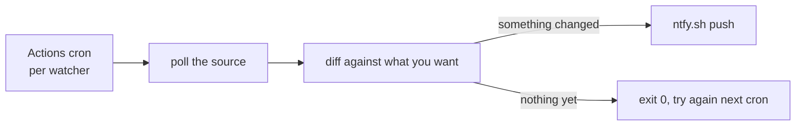

```
 ███████╗██╗██████╗ ███████╗███╗   ██╗
 ██╔════╝██║██╔══██╗██╔════╝████╗  ██║
 ███████╗██║██████╔╝█████╗  ██╔██╗ ██║
 ╚════██║██║██╔══██╗██╔══╝  ██║╚██╗██║
 ███████║██║██║  ██║███████╗██║ ╚████║
 ╚══════╝╚═╝╚═╝  ╚═╝╚══════╝╚═╝  ╚═══╝
```

<div align="center">

### `EVERY ALERT THAT HAS TO POLL SOMETHING, IN ONE REPO`

*a folder, a cron, a push to your phone — repeat*

    

</div>

---

## 📡 What is this

Some things you only find out by asking again and again: did the tickets drop, did the row get added, did the number move. Siren is where those questions live. Each one is a folder with a script, a GitHub Actions cron on its own schedule, and an [ntfy.sh](https://ntfy.sh) push at the end of it.

No database, no queue, no plugin system. A watcher is a folder and a workflow file. Adding one is copying a folder.

```console
nick@siren:~$ bun cinema/watch.ts
AVENGERS: nothing yet
DUNE: nothing yet

nick@siren:~$ bun repos/sync.ts
2 added, 3 refreshed
[i] the machine asks so you don't have to.
```

## 🎬 `cinema` — ticket drops

IMAX tickets for hype releases at Village Cinemas Greece sell out in hours, and the new date blocks appear whenever the cinema feels like it. This watcher polls the booking page every five minutes, parses the `bookingData` JSON embedded in the HTML, and fires an **urgent** push the moment showtimes matching your hunt list go live.

There is no state. A triggered watch alarms again every five minutes until you delete its entry from `cinema/watches.json` — it is an alarm, not a log, and you silence it the same way you silence any alarm: by getting up and buying the tickets.

Each entry in `cinema/watches.json` is one movie you refuse to miss:

| | field | what it actually does |
|---|---|---|
| 01 | **title** | case-insensitive substring match against the listings — `"DUNE"` catches `DUNE: PART THREE` |
| 02 | **imax** | optional — only IMAX / IMAX 3D screens count (there is exactly one IMAX in Greece, at The Mall Athens) |
| 03 | **cinema** | optional cinema id — `21` The Mall Athens, `01` Rentis, `03` Pagrati, `22` Thessaloniki, `23` Volos, `26` Athens Metro Mall, `30` Larissa |
| 04 | **from** | optional `YYYY-MM-DD` — ignore showtimes before this date (for when the near dates are already gone) |

Built for THE ODYSSEY in IMAX. The 30/07 dates dropped while the first version was still being written (tickets secured, watcher instantly obsolete, repo repurposed the same week).

## 🗂 `repos` — Notion sync

A projects database is only useful while it is true. This one diffs GitHub against a Notion database once a day, matched on a `GitHub Repo ID` property so renaming a repo does not fork it into two rows. A new repo gets a row, a drifted `Last Pushed` gets corrected, and the push only fires when something actually changed.

`Category` is left blank on new rows deliberately. It is the one field an API cannot guess, and an empty cell is a better reminder than a wrong guess. Idea-stage rows with no repo id are never touched.

This repo is public, so its Actions logs are world-readable — the job prints counts only. The repo names go to your phone, not the log.

## 🚀 Run it

```bash
git clone https://github.com/nitrimandylis/siren.git
cd siren
bun test              # 13 tests on the parsers, filters, and diff
bun cinema/watch.ts   # one manual poll
bun repos/sync.ts     # one manual sync
```

To arm it, set these as GitHub Actions secrets:

| secret | used by | what it is |
|---|---|---|
| `NTFY_TOPIC` | all | your ntfy topic — pick something unguessable like `odyssey-imax-x7k2f9`, then subscribe to it in the ntfy app |
| `GH_PAT` | `repos` | classic token with `repo` scope, so private repos are visible |
| `NOTION_TOKEN` | `repos` | internal integration token, with the database shared to that integration |

GitHub disables schedules after 60 days without commits — re-enable from the Actions tab when release week nears (polling in July for a December premiere is just cardio for the runner).

## 🔩 Under the hood



| layer | path | job |
|---|---|---|
| push | `ntfy.ts` | the one place `NTFY_TOPIC` is read — every watcher sends through it |
| watcher | `cinema/`, `repos/` | one folder each, self-contained, no shared state |
| cron | `.github/workflows/*.yml` | one workflow per watcher, own schedule, offset from `:00` because github delays on-the-hour jobs |
| tests | `*/*.test.ts` | what actually breaks if a parser or the diff breaks |

**Stack:** bun · typescript · github actions · ntfy.sh — no dependencies, the sources' own JSON does all the work

**Credits:** the `bookingData` trick comes from [johneliades/village_crawler](https://github.com/johneliades/village_crawler), which mapped out the Village booking page's embedded JSON first.

---

<div align="center">

**[Nick Trimandylis](https://github.com/nitrimandylis)**

`THE F5 KEY IS RETIRED`

MIT licensed.

</div>
