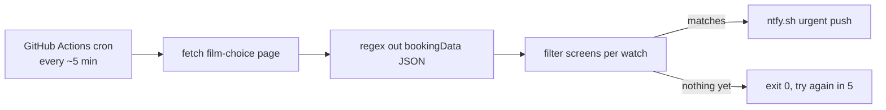

```
 ██╗███╗   ███╗ █████╗ ██╗  ██╗
 ██║████╗ ████║██╔══██╗╚██╗██╔╝
 ██║██╔████╔██║███████║ ╚███╔╝
 ██║██║╚██╔╝██║██╔══██║ ██╔██╗
 ██║██║ ╚═╝ ██║██║  ██║██╔╝ ██╗
 ╚═╝╚═╝     ╚═╝╚═╝  ╚═╝╚═╝  ╚═╝
 ██████╗ ██╗███╗   ██╗ ██████╗
 ██╔══██╗██║████╗  ██║██╔════╝
 ██████╔╝██║██╔██╗ ██║██║  ███╗
 ██╔═══╝ ██║██║╚██╗██║██║   ██║
 ██║     ██║██║ ╚████║╚██████╔╝
 ╚═╝     ╚═╝╚═╝  ╚═══╝ ╚═════╝
```

<div align="center">

### `NEVER MISS A DROP // VILLAGE CINEMAS TICKET WATCHER`

*polls the booking page every five minutes so you don't have to*

    

</div>

---

## 🎬 What is this

IMAX tickets for hype releases at Village Cinemas Greece sell out in hours, and the new date blocks appear whenever the cinema feels like it. This watcher polls the Village booking page from a GitHub Actions cron, parses the `bookingData` JSON embedded in the HTML, and fires an urgent [ntfy.sh](https://ntfy.sh) push to your phone the moment showtimes matching your hunt list go live.

There is no database and no state. A triggered watch alarms again every five minutes until you delete its entry from `watches.json` — it is an alarm, not a log, and you silence it the same way you silence any alarm: by getting up and buying the tickets.

Built for THE ODYSSEY in IMAX. The 30/07 dates dropped while the first version was still being written (tickets secured, watcher instantly obsolete, repo repurposed the same week).

```console
nick@imax-ping:~$ bun watch.ts
AVENGERS: nothing yet
DUNE: nothing yet
[i] the machine waits so you can sleep.
```

## 🚨 The hunt list

Each entry in `watches.json` is one movie you refuse to miss:

| | field | what it actually does |
|---|---|---|
| 01 | **title** | case-insensitive substring match against the listings — `"DUNE"` catches `DUNE: PART THREE` |
| 02 | **imax** | optional — only IMAX / IMAX 3D screens count (there is exactly one IMAX in Greece, at The Mall Athens) |
| 03 | **cinema** | optional cinema id — `21` The Mall Athens, `01` Rentis, `03` Pagrati, `22` Thessaloniki, `23` Volos, `26` Athens Metro Mall, `30` Larissa |
| 04 | **from** | optional `YYYY-MM-DD` — ignore showtimes before this date (for when the near dates are already gone) |

## 🚀 Run it

Fork it, then:

```bash
git clone https://github.com/nitrimandylis/imax-ping.git
cd imax-ping
bun test          # 5 tests on the parser and filters
bun watch.ts      # one manual poll, needs NTFY_TOPIC to actually ping
```

To arm it for real: edit `watches.json`, set `NTFY_TOPIC` as a GitHub Actions secret (pick something unguessable like `odyssey-imax-x7k2f9`), subscribe to that topic in the ntfy app, and let the cron do the rest. GitHub disables the schedule after 60 days without commits — re-enable it from the Actions tab when release week nears (polling in July for a December premiere is just cardio for the runner).

## 🔩 Under the hood



| layer | path | job |
|---|---|---|
| watcher | `watch.ts` | fetch, parse, filter, scream — ~100 lines, zero imports beyond the config |
| hunt list | `watches.json` | the movies being watched, one object each |
| cron | `.github/workflows/watch.yml` | checkout, setup-bun, run — offset from :00 because github delays on-the-hour jobs |
| tests | `watch.test.ts` | what actually breaks if the parser or filters break |

**Stack:** bun · typescript · github actions · ntfy.sh — no dependencies, the site's own embedded JSON does all the work

---

<div align="center">

**[Nick Trimandylis](https://github.com/nitrimandylis)**

`THE F5 KEY IS RETIRED`

MIT licensed.

</div>
